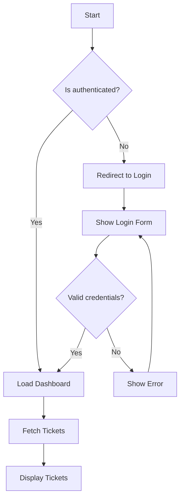
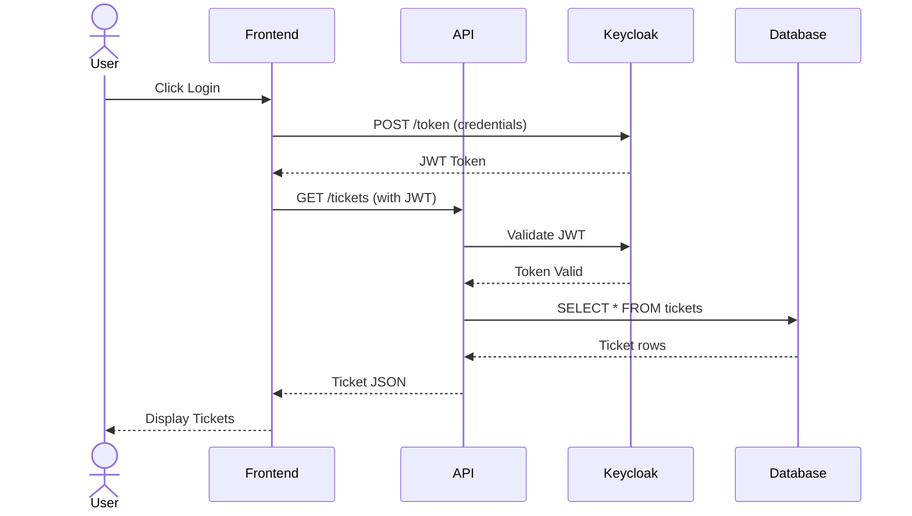
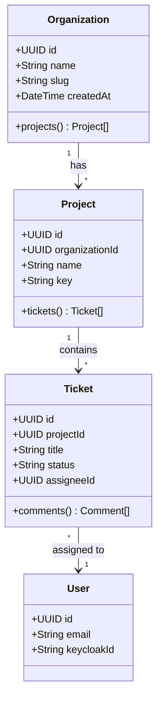
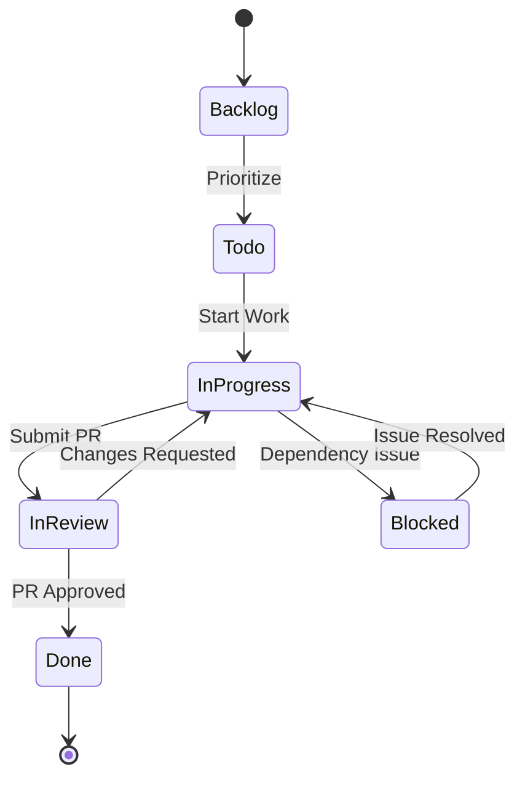
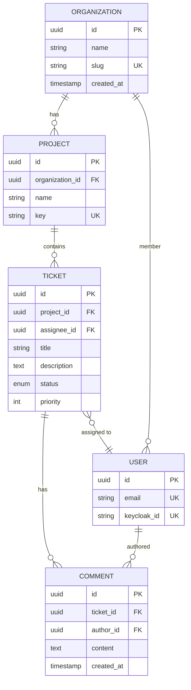
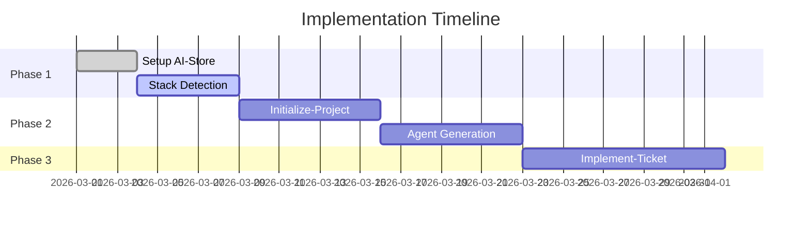
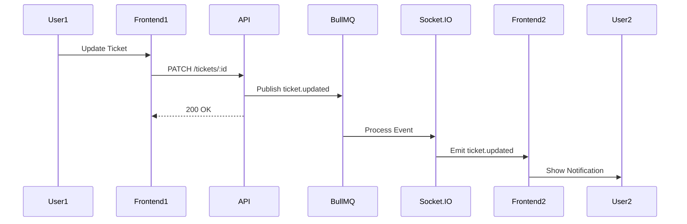
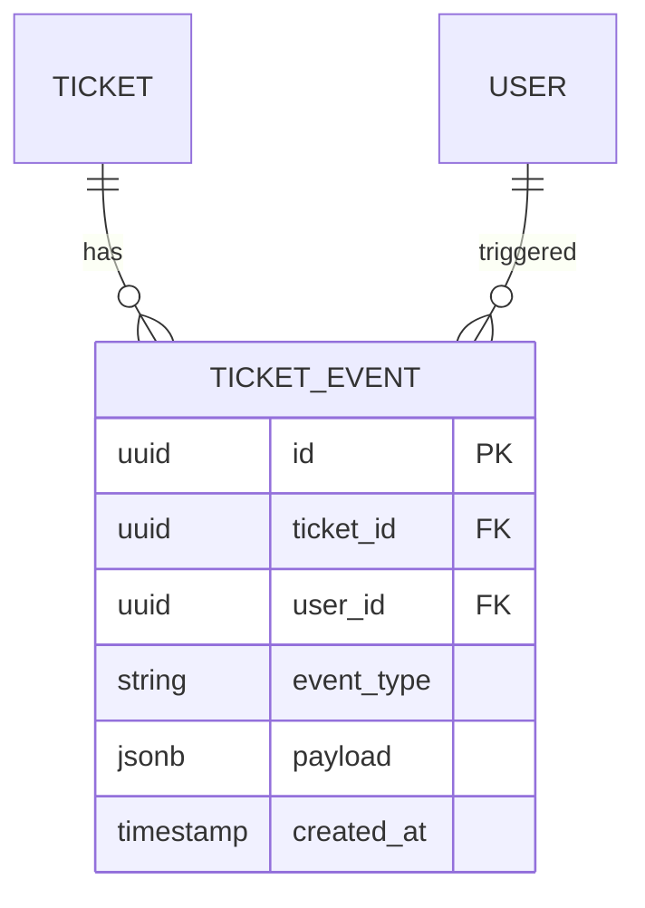

# Design Doc Mermaid Skill

Generate comprehensive technical diagrams using Mermaid syntax for design documents, pull requests, and architecture documentation.

## When to Use

- Documenting system architecture for PRs
- Creating sequence diagrams for API workflows
- Visualizing database schemas (ERD)
- Showing state machines or flowcharts
- Explaining data flows between services

## Supported Diagram Types

### 1. Flowchart

**Use for**: Decision trees, process flows, algorithm logic



**Syntax**:

```
flowchart TD
    A[Node] --> B{Decision}
    B -->|Yes| C[Action]
    B -->|No| D[Alternative]
```

### 2. Sequence Diagram

**Use for**: API interactions, request/response flows, authentication flows



**Syntax**:

```
sequenceDiagram
    participant A
    participant B
    A->>B: Request
    B-->>A: Response
    Note over A,B: Async operation
```

### 3. Class Diagram (ERD)

**Use for**: Database schemas, TypeScript types, domain models



**Syntax**:

```
classDiagram
    class Entity {
        +Type field
        +method() ReturnType
    }
    Entity "1" --> "*" RelatedEntity : relationship
```

### 4. State Diagram

**Use for**: Ticket workflows, order states, approval processes



**Syntax**:

```
stateDiagram-v2
    [*] --> State1
    State1 --> State2 : event
    State2 --> [*]
```

### 5. Entity Relationship Diagram

**Use for**: Database table relationships



**Syntax**:

```
erDiagram
    TABLE1 ||--o{ TABLE2 : "relationship"
    TABLE1 {
        type column
    }
```

### 6. Gitgraph (Branch Visualization)

**Use for**: Explaining git workflows, branching strategies

```mermaid
gitgraph
    commit id: "Initial"
    branch develop
    checkout develop
    commit id: "Setup"
    branch feature/EV-123
    checkout feature/EV-123
    commit id: "Implement"
    commit id: "Tests"
    checkout develop
    merge feature/EV-123
    checkout main
    merge develop tag: "v1.0.0"
```

### 7. Gantt Chart

**Use for**: Project timelines, sprint planning



## Best Practices

### 1. Keep It Simple

- Maximum 10-15 nodes per diagram
- Use subgraphs for grouping (flowcharts)
- Break complex flows into multiple diagrams

### 2. Use Consistent Naming

- `camelCase` for internal entities
- `PascalCase` for classes/types
- `snake_case` for database columns

### 3. Add Context

- Include a title/heading above diagram
- Explain what the diagram shows
- Link to related documentation

### 4. Color Coding (Optional)

```
style NodeA fill:#f9f,stroke:#333,stroke-width:2px
style NodeB fill:#bbf,stroke:#333,stroke-width:2px
```

### 5. Notes and Annotations

```
Note over User,API: Authentication flow
Note right of API: Validates JWT
```

## Integration with Pull Requests

When creating a PR with architectural changes:

1. **Analyze Changes**: Identify affected components
2. **Choose Diagram Type**:
   - New API endpoints → Sequence diagram
   - Database changes → ERD
   - Complex logic → Flowchart
   - Service interaction → Component diagram
3. **Generate Diagram**: Use Mermaid syntax
4. **Add to PR Description**:

   ````markdown
   ## Architecture

   ### Data Flow

   ```mermaid
   flowchart LR
       A[Client] --> B[API]
       B --> C[Database]
   ```
   ````

   ```

   ```

5. **Explain Context**: Add 2-3 sentences describing the diagram

## Example: PR with Mermaid

````markdown
# Add Real-Time Ticket Updates

## Changes

- Implemented Socket.IO for ticket updates
- Added BullMQ queue for event distribution
- Updated frontend to subscribe to ticket events

## Architecture

### Real-Time Update Flow


````

This diagram shows how ticket updates are propagated in real-time using BullMQ and Socket.IO.

### Database Schema Changes



Added `ticket_events` table to store audit log of all ticket changes.

```

## Mermaid Live Editor

Test diagrams at: https://mermaid.live

## Limitations

- GitHub renders Mermaid automatically
- Some Jira flavors may not support Mermaid (use images)
- Complex diagrams may be slow to render

## Alternative: PlantUML

If Mermaid doesn't support your use case, consider PlantUML for:
- Deployment diagrams
- Component diagrams
- Timing diagrams

## References

- Mermaid Docs: https://mermaid.js.org/
- Syntax Cheat Sheet: https://mermaid.js.org/syntax/
- Live Editor: https://mermaid.live
```
